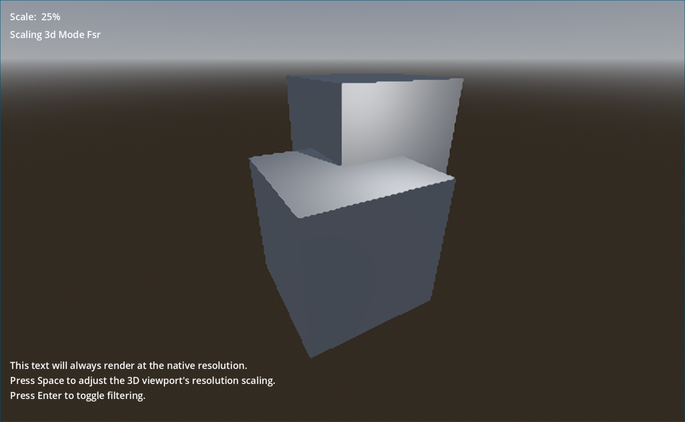

# 3D Resolution Scaling

This demo shows how to downscale the 3D resolution without affecting 2D
elements, to improve performance without making the UI blurry.
This uses built-in resolution scaling supported by the `Forward+` renderer.
If you're using the `Compatibility` renderer, see ../3d_scaling_compat instead.

Language: GDScript

Renderer: Forward+

## Screenshots

