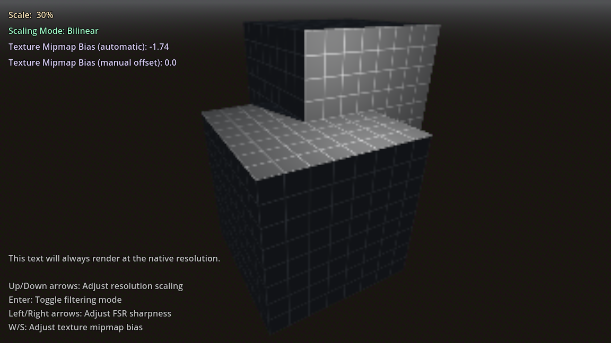

# 3D Resolution Scaling

This demo shows how to downscale the 3D resolution without affecting 2D
elements, to improve performance without making the UI blurry.
This uses built-in resolution scaling supported by the Forward+ and Mobile rendering methods.
If you're using the Compatibility rendering method, see [3D Resolution Scaling (Compatibility)](../3d_scaling_compat) instead.

Language: GDScript

Renderer: Forward+

## Screenshots

